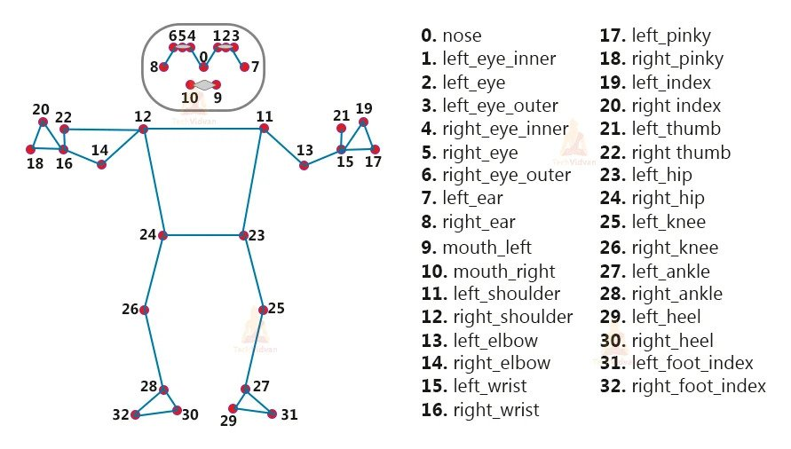

# Pose Detection Using CvZone Python

## Introduction

3D pose estimation is a process of predicting the transformation of an object from a user-defined reference pose, given an image or a 3D scan. It arises in computer vision or robotics where the pose or transformation of an object can be used for alignment of Computer-Aided Design models, identification, grasping, or manipulation of the object.


## Features
- Detect pose of a human body.
- Calculate the distance between the hand's key points.


## Technologies & Frameworks

- Python 3.8
- OpenCV
- CVzone

## Body Keypoints



## What is CVZONE?

CVzone is the main Framework that is used in this prototype, it is a computer vision package that makes us easy to run like face detection, hand tracking, pose estimation, etc., and also image processing and other AI functions.


## Configuration and Setup

Python is the main programming language of this prototype, OpenCV and CVzone are the major Frameworks.


- Installing OpenCV

  ```python
  pip install opencv-python
  ```

- Installing cvzone

    ```python
    pip install cvzone
    ```

- Or, Installing cvzone using GitHub, (If "pip install cvzone" does not work)

    ```python
    pip install git+https://github.com/cvzone/cvzone.git
    ```


## Demo


# Contact

### Website: 

[](https://www.gunarakulan.info)

### Social Media:

[](https://www.linkedin.com/in/gunarakulangunaretnam)
[](https://www.facebook.com/gunarakulangunaretnam)
[](https://wa.me/94740001141?text=WhatsApp%3A%20%2B9740001141)
[](https://www.instagram.com/gunarakulangunaretnam)
[](https://x.com/gunarakulangr)
[](https://www.kaggle.com/gunarakulangr)
[](https://www.tiktok.com/@gunarakulangunaretnam)
[](https://www.youtube.com/channel/UCjMOdgHFAjAdBKiqV8y2Tww)
